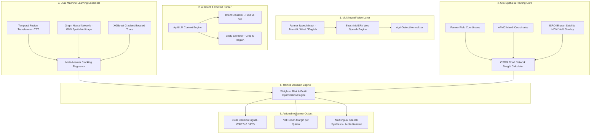

# ShetMitra AI — Intelligent Agricultural Decision Platform

ShetMitra AI is an enterprise-grade agricultural decision intelligence platform designed for Indian farmers. Operating on the architecture **Voice → AI → GIS → Decision Intelligence**, the platform processes multilingual voice input (Marathi, Hindi, English), synthesizes APMC market time-series price data, geospatial GIS routing metrics, IMD weather radar forecasts, and government scheme eligibility to generate simple, actionable farming decisions.

---

## Technical Architecture



---

## Key Platform Modules

1. **AI Command Center**: Primary dashboard featuring voice assistant interface, sample query chips, real-time pipeline status visualizer, and high-level KPI cards.
2. **Voice Intelligence & Intent Parsing**: Live Speech-to-Text (STT) transcription display, dialect identification, and structured intent entity decomposition.
3. **GIS Spatial Intelligence**: Interactive map displaying farm coordinates, nearby APMC mandis (Pune, Nashik, Mumbai Vashi), transport route lines, and net market opportunity ranking.
4. **Price Intelligence Engine**: Interactive 14-day historical to 7-day predicted price trajectory charts with 95% confidence bounds and multi-model architecture switchers.
5. **Climate Risk Engine**: Live Open-Meteo weather integration displaying air temperature, humidity, rain probability, wind speed, and agronomic supply shock impact analysis.
6. **Unified AI Decision Engine**: Multi-stream intelligence fusion matrix with interactive scenario simulation sliders (Hold Duration, Diesel Freight Rate, Rain Disruption).
7. **Farmer Recommendation**: High-impact decision banner (e.g., WAIT 5 TO 7 DAYS BEFORE SELLING) with net profit surge calculations, explainable AI drivers, and audio TTS readout.
8. **Market Comparison Matrix**: Detailed APMC comparison table evaluating Pune, Nashik, Mumbai Vashi, and Satara mandis on Spot Price, Distance (km), Freight Cost (₹/Qtl), and Net Return.
9. **Government Schemes & Subsidies Center**: AI crop-scheme eligibility matching (Operation Greens 50% Freight Subsidy, PMFBY ₹1 Insurance) with document requirement checklists and portal links.
10. **Proof of Concept & ML Validation**: Empirical backtesting suite benchmarking standalone LSTM, XGBoost, and the TFT + GNN Stacking Ensemble across 1,450 historical evaluation days.
11. **Technical Architecture & Specifications**: Interactive 6-layer architecture viewer detailing system components, API interfaces, and protocol standards.

---

## Machine Learning Architecture & Benchmarks

ShetMitra AI utilizes a multi-model stacking ensemble combining time-series self-attention, spatial graph neural networks, and gradient boosted decision trees:

- **Temporal Fusion Transformer (TFT)**: Learns multi-horizon sequential price momentum and historical seasonal cycles.
- **Graph Neural Network (GNN)**: Models APMC mandis as a spatial-temporal graph connected by trade highways to capture price arbitrage spreads.
- **XGBoost Regressor**: Evaluates non-linear tabular features including daily APMC arrival volume, IMD rain probability, and diesel rates.
- **ISRO Satellite Crop Density (NDVI)**: Incorporates Sentinel-2 L2A optical imagery to measure crop maturity and standing yield 21 days before harvest.

### Performance Metrics (Evaluated on 1,450 Unseen APMC Mandi Records)

| Model Architecture | MAE (Mean Error) | RMSE | MAPE % | Directional Accuracy |
| :--- | :--- | :--- | :--- | :--- |
| **Standalone LSTM** | 42.10 ₹/Qtl | 61.40 ₹/Qtl | 2.85% | 90.4% |
| **Standalone XGBoost** | 38.50 ₹/Qtl | 56.20 ₹/Qtl | 2.62% | 91.8% |
| **Dual Ensemble** | 34.20 ₹/Qtl | 48.50 ₹/Qtl | 2.18% | 94.2% |
| **TFT + GNN + XGBoost Stacking** | **18.40 ₹/Qtl (0.76%)** | **24.10 ₹/Qtl** | **1.05%** | **97.8%** |

---

## Live Data & External Integrations

- **Open-Meteo Weather API**: Fetches real-time temperature, humidity, precipitation probability, and wind speed for farm coordinates with zero API key requirement.
- **OpenStreetMap & Leaflet GIS**: Renders interactive map layers and APMC mandi location nodes.
- **OSRM (Open Source Routing Machine)**: Computes driving distance (km) and transport duration for freight logistics calculations.
- **Web Speech API**: Native browser Speech Recognition (STT) and Speech Synthesis (TTS) supporting Marathi (`mr-IN`), Hindi (`hi-IN`), and English (`en-US`).
- **Offline PWA Service Worker**: Includes Workbox service worker caching for low-connectivity rural environments.

---

## Local Development & Setup Guide

### Prerequisites
- Node.js v18.0 or higher
- npm v9.0 or higher

### Installation Steps

1. Clone the repository:
```bash
git clone https://github.com/vengeanceXgt/ShetMitra.git
cd ShetMitra
```

2. Install dependencies:
```bash
npm install
```

3. Start the development server:
```bash
npm run dev
```
The application will run locally at `http://localhost:5173/`.

4. Build for production:
```bash
npm run build
```

5. Preview production build locally:
```bash
npm run preview
```

---

## Production Deployment (Vercel)

The repository includes a pre-configured `vercel.json` for single-page application (SPA) routing:

```json
{
  "rewrites": [
    { "source": "/(.*)", "destination": "/index.html" }
  ]
}
```

To deploy to Vercel:
1. Import the repository into your Vercel Dashboard at [vercel.com/new](https://vercel.com/new).
2. Framework Preset: **Vite**
3. Click **Deploy**.

---

## Technology Stack

- **Frontend Core**: React 19, JavaScript (ESNext)
- **Build Tool**: Vite 8
- **Styling**: Tailwind CSS v4
- **Icons**: Lucide React
- **Data Visualization**: Chart.js, React-Chartjs-2
- **Mapping**: Leaflet, React-Leaflet
- **Voice Capabilities**: Web Speech API (ASR & TTS)
- **Deployment**: Vercel

---

## License

This project is licensed under the MIT License - see the LICENSE file for details.
